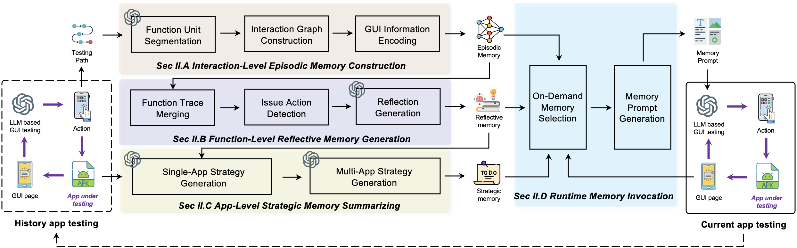
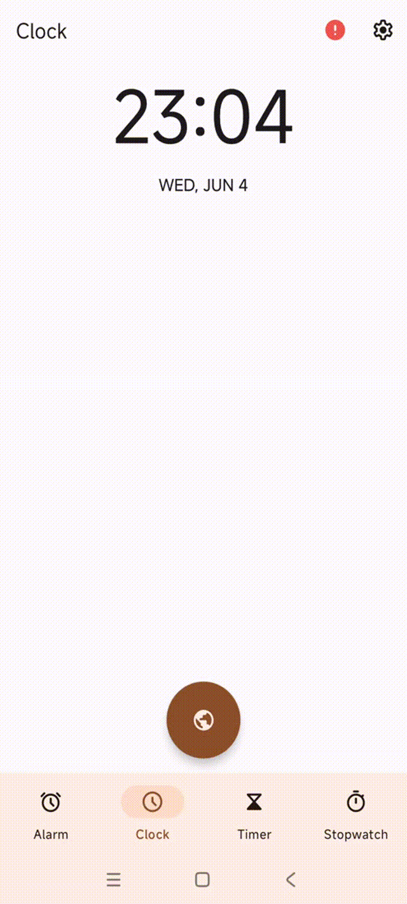
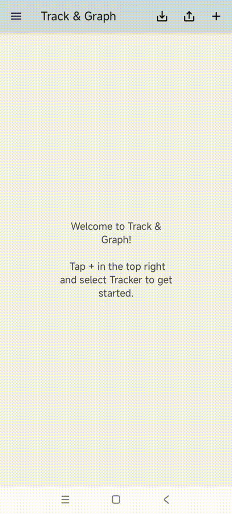
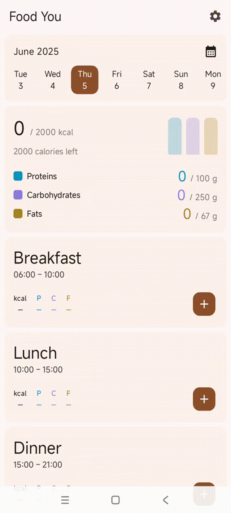
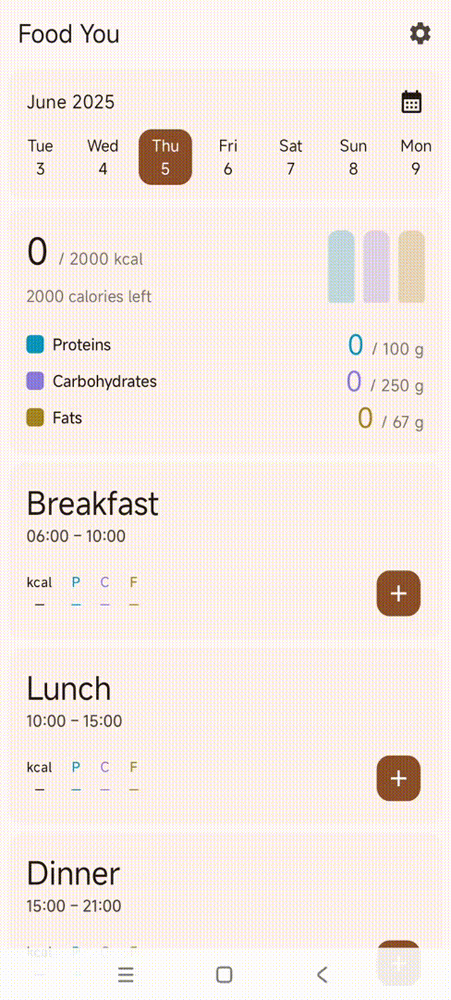

# MemoDroid

## 🚀 Introduction

LLM-based GUI agents are increasingly used for automated app testing by interpreting GUI screenshots and generating interactions. However, existing agents lack long-term memory and treat each app as a cold start, missing the opportunity to learn from prior sessions.

MemoDroid addresses this by introducing a **three-layer memory mechanism**:
- **Episodic Memory**: Captures functional interaction traces (screenshots, actions, transition graphs).
- **Reflective Memory**: Summarizes redundant or issue-prone behaviors into natural language.
- **Strategic Memory**: Synthesizes high-level exploration strategies across apps or domains.

These memory layers are **dynamically retrieved** during testing and injected into LLM prompts to:
- Reuse successful past behaviors,
- Avoid ineffective or redundant actions,
- Prioritize bug-prone paths.

---

## 🧠 Architecture



MemoDroid is a lightweight plugin and works **on top of any LLM-based GUI testing framework**. Memory is triggered:
- At cold start (strategic memory),
- During testing stagnation (reflective memory),
- At functional transitions (episodic memory).

Each memory item is encoded using **CLIP-style vision-text encoders** and **graph embeddings**, allowing efficient retrieval by similarity.

---

## 📦 Features

- ✅ LLM-based multimodal understanding (screenshots + GUI hierarchy).
- 🧠 Three-level memory mechanism (episodic, reflective, strategic).
- 🔁 Dynamic memory retrieval and injection.
- 📈 Significant improvement in activity/code coverage and bug detection.
- 🧪 Supports version evolution & platform transfer (Android → Web).

---

## 🎥 Demo Comparisons

Below are visual comparisons between baseline approaches and their MemoDroid-enhanced versions, demonstrating the improved testing capabilities:

<div style="width: 100%; overflow-x: auto;">
<div style="display: flex; gap: 20px; padding: 20px 0;">
    <div style="flex: 0 0 auto; text-align: center;">
        
        <p><em>GPTDroid</em></p>
    </div>
    <div style="flex: 0 0 auto; text-align: center;">
        
        <p><em>GPTDroid+MemoDroid</em></p>
    </div>
    <div style="flex: 0 0 auto; text-align: center;">
        
        <p><em>DroidAgent</em></p>
    </div>
    <div style="flex: 0 0 auto; text-align: center;">
        
        <p><em>DroidAgent+MemoDroid</em></p>
    </div>
    <div style="flex: 0 0 auto; text-align: center;">
        
        <p><em>AUITestAgent</em></p>
    </div>
    <div style="flex: 0 0 auto; text-align: center;">
        
        <p><em>AUITestAgent+MemoDroid</em></p>
    </div>
    <div style="flex: 0 0 auto; text-align: center;">
        
        <p><em>VisionDroid</em></p>
    </div>
    <div style="flex: 0 0 auto; text-align: center;">
        
        <p><em>VisionDroid+MemoDroid</em></p>
    </div>
    <div style="flex: 0 0 auto; text-align: center;">
        
        <p><em>Guardian</em></p>
    </div>
    <div style="flex: 0 0 auto; text-align: center;">
        
        <p><em>Guardian+MemoDroid</em></p>
    </div>
</div>
</div>

These demos showcase how MemoDroid enhances each baseline approach by leveraging its three-layer memory mechanism to achieve more effective app exploration and testing.

---

# Experiment Results

## RQ1: Effectiveness Evaluation
Our evaluation on 30 real-world Android apps across 15 categories demonstrates that MemoDroid significantly enhances GUI testing performance across all five baseline approaches:

| Baseline          | Activity Coverage Improvement | Code Coverage Improvement | Bug Detection Improvement |
|-------------------|-------------------------------|---------------------------|---------------------------|
| GPTDroid          | ↑79%                          | ↑81%                      | ↑194%                     |
| DroidAgent        | ↑96%                          | ↑89%                      | ↑198%                     |
| AUITestAgent      | ↑86%                          | ↑86%                      | ↑57%                      |
| VisionDroid       | ↑88%                          | ↑87%                      | ↑71%                      |
| Guardian          | ↑93%                          | ↑97%                      | ↑72%                      |

Key findings:
- Episodic memory enables effective action replication
- Reflective memory helps identify crash-prone behaviors
- Strategic memory provides high-level exploration guidance

## RQ2: Ablation Study
Removing any memory layer causes significant performance degradation:

| Memory Layer Removed | Avg. Coverage Drop | Avg. Bug Detection Drop |
|----------------------|--------------------|-------------------------|
| Episodic Memory      | 23-26%             | 14-24%                  |
| Reflective Memory    | 29-38%             | 19-39%                  |
| Strategic Memory     | 15-22%             | 11-19%                  |

Reflective memory shows the strongest individual contribution to performance.

## RQ3: Memory Evolving Effect
Testing performance improves progressively as memory pool expands:

- Initial 5 apps provide sufficient diversity for generalization
- Performance gains continue through 60-app memory pool
- VisionDroid+MemoDroid achieves 0.71 activity coverage (+73% from baseline)

## RQ4: Practical Usefulness
In large-scale evaluation on 200 popular apps:
- Detected **49 previously unknown bugs** in 47 apps
- **35 bugs fixed** and **14 confirmed** by developers
- 7 bugs were only detectable with MemoDroid augmentation

| ID | App name        | Category | Down  | Version | Status    | GP | GP+MemoDroid | DA | DA+MemoDroid | ATA | ATA+MemoDroid | VD | VD+MemoDroid | GU | GU+MemoDroid |
| -- | --------------- | -------- | ----- | ------- | --------- | -- | ------------ | -- | ------------ | --- | ------------- | -- | ------------ | -- | ------------ |
| 1  | Traveloka       | Travel   | 50M+  | 5.20.0  | Fixed     |    | \*           |    | \*           |     | \*            |    | \*           |    | \*           |
| 2  | Yelp            | Food     | 50M+  | 25.11   | Fixed     |    | \*           |    | \*           |     | \*            |    | \*           |    | \*           |
| 3  | BeautyCam       | Photo    | 50M+  | 12.5.35 | Fixed     |    | \*           |    |              |     | \*            |    | \*           |    | \*           |
| 4  | Wattpad         | Book     | 50M+  | 11.2.0  | Fixed     | \* | \*           | \* | \*           | \*  | \*            | \* | \*           | \* | \*           |
| 5  | Strava          | Health   | 50M+  | 4.2.5   | Fixed     |    | \*           |    | \*           |     | \*            |    | \*           |    | \*           |
| 6  | Klook           | Travel   | 10M+  | 7.20.2  | Fixed     |    | \*           |    | \*           |     | \*            |    | \*           |    | \*           |
| 7  | HelloTalk       | Edu      | 10M+  | 6.0.6   | Fixed     |    | \*           |    | \*           |     | \*            |    | \*           |    | \*           |
| 8  | Xbrowser        | Commun   | 10M+  | 5.2.0   | Fixed     |    |              |    |              |     |               |    | \*           |    | \*           |
| 9  | MMWbO           | Health   | 10M+  | 25.2.0  | Fixed     | \* | \*           | \* | \*           |     | \*            |    | \*           | \* | \*           |
| 10 | SportsTrack     | Health   | 10M+  | 5.0.1   | Fixed     |    | \*           |    | \*           |     | \*            |    | \*           |    | \*           |
| 11 | Deliveroo       | Food     | 10M+  | 3.215   | Fixed     |    | \*           |    |              |     | \*            |    | \*           |    | \*           |
| 12 | KiKUU           | Shop     | 10M+  | 30.1.6  | Fixed     |    | \*           | \* | \*           |     | \*            |    | \*           |    | \*           |
| 13 | Wink            | Video    | 10M+  | 2.7.5   | Fixed     | \* | \*           |    | \*           |     | \*            | \* | \*           | \* | \*           |
| 14 | StepsApp        | Health   | 10M+  | 6.0.12  | Fixed     |    | \*           |    | \*           |     | \*            |    | \*           |    | \*           |
| 15 | eSound          | Music    | 10M+  | 6.11    | Fixed     |    |              |    | \*           |     | \*            |    | \*           |    | \*           |
| 16 | HabitNow        | Product  | 5M+   | 2.2.3d  | Fixed     |    | \*           |    | \*           |     | \*            |    | \*           |    | \*           |
| 17 | Sectograph      | Product  | 5M+   | 2.3.1   | Fixed     |    | \*           |    | \*           |     | \*            |    | \*           |    | \*           |
| 18 | Comera          | Commun   | 5M+   | 5.0.23  | Fixed     |    |              |    |              |     | \*            |    | \*           | \* | \*           |
| 19 | NetSpeed        | Tool     | 5M+   | 1.10.0  | Fixed     |    | \*           |    | \*           |     |               |    | \*           | \* | \*           |
| 20 | Speaky          | Edu      | 5M+   | 3.3.5   | Fixed     |    | \*           |    | \*           |     | \*            |    | \*           |    | \*           |
| 21 | FSBrowser       | Social   | 5M+   | 8.4.38  | Fixed     | \* | \*           |    | \*           | \*  | \*            |    | \*           |    | \*           |
| 22 | Sketchbook      | Art      | 5M+   | 6.10.0  | Fixed     |    | \*           |    | \*           |     | \*            |    | \*           |    | \*           |
| 23 | FlipaClip       | Art      | 5M+   | 4.2.5   | Fixed     |    |              |    |              |     | \*            |    | \*           |    | \*           |
| 24 | ClickUp         | Product  | 1M+   | 5.4.6   | Fixed     |    | \*           |    | \*           |     | \*            | \* | \*           |    | \*           |
| 25 | Tawasal         | Commun   | 1M+   | 5.4.0   | Fixed     |    | \*           | \* | \*           |     | \*            | \* | \*           | \* | \*           |
| 26 | VERO            | Social   | 1M+   | 2.3.3   | Fixed     |    | \*           |    | \*           |     | \*            |    | \*           |    | \*           |
| 27 | Hilokal         | Edu      | 1M+   | 12.15.3 | Fixed     |    | \*           |    | \*           |     | \*            |    | \*           |    | \*           |
| 28 | 9Weather        | Weather  | 1M+   | 1.134   | Fixed     |    | \*           |    | \*           |     | \*            | \* | \*           | \* | \*           |
| 29 | BEA             | Finance  | 1M+   | 10.0.1  | Fixed     |    | \*           |    | \*           |     | \*            |    | \*           |    | \*           |
| 30 | Joytify         | Music    | 1M+   | 1.2.9   | Fixed     |    | \*           |    | \*           |     |               |    | \*           |    | \*           |
| 31 | Weezer          | Music    | 1M+   | 2.4.4   | Fixed     |    | \*           |    | \*           |     | \*            |    | \*           |    | \*           |
| 32 | Vyke            | Commun   | 1M+   | 1.20.3  | Fixed     |    | \*           |    | \*           |     | \*            |    | \*           |    | \*           |
| 33 | DailyExpenses   | Finance  | 1M+   | 249     | Fixed     |    |              |    |              |     | \*            |    | \*           |    | \*           |
| 34 | Supershift      | Product  | 1M+   | 25.15   | Fixed     |    | \*           |    | \*           |     | \*            |    | \*           |    | \*           |
| 35 | Timeleft        | Travel   | 500K+ | 3.3.0   | Fixed     |    | \*           |    | \*           |     | \*            |    | \*           |    | \*           |
| 36 | Sofascore       | Sport    | 50M+  | 13.3    | Confirmed |    |              |    |              |     |               |    | \*           |    | \*           |
| 37 | WePlay          | Enter    | 10M+  | 5.2.10  | Confirmed |    | \*           |    | \*           |     | \*            |    | \*           |    | \*           |
| 38 | FotMob          | Sport    | 10M+  | 9.2     | Confirmed |    | \*           |    | \*           |     | \*            |    | \*           |    | \*           |
| 39 | Bluecoins       | Finance  | 1M+   | 12.9.5  | Confirmed |    | \*           |    | \*           |     | \*            |    | \*           |    | \*           |
| 40 | Logos Bible     | Book     | 1M+   | 42.0.2  | Confirmed |    | \*           |    | \*           |     | \*            |    | \*           |    | \*           |
| 41 | Moviebase       | Enter    | 1M+   | 5.3.15  | Confirmed |    | \*           |    |              |     | \*            |    | \*           |    | \*           |
| 42 | Domino's        | Food     | 1M+   | 2.0.39  | Confirmed |    | \*           |    | \*           |     | \*            |    | \*           |    | \*           |
| 43 | Weezer          | Music    | 1M+   | 2.4.4   | Confirmed |    | \*           |    | \*           |     | \*            |    | \*           |    | \*           |
| 44 | Eatigo          | Food     | 1M+   | 8.10.0  | Confirmed |    | \*           |    | \*           |     | \*            |    | \*           |    | \*           |
| 45 | SideChef        | Food     | 1M+   | 5.31.1  | Confirmed |    |              |    |              |     | \*            |    | \*           |    | \*           |
| 46 | BluShopSMecoins | Shop     | 1M+   | 5.3.0   | Confirmed |    | \*           |    | \*           |     | \*            |    | \*           |    | \*           |
| 47 | Moviebase       | Enter    | 1M+   | 5.3.15  | Confirmed |    | \*           |    | \*           |     | \*            |    | \*           |    | \*           |
| 48 | Domino's        | Food     | 1M+   | 2.0.39  | Confirmed |    | \*           |    | \*           |     | \*            |    | \*           |    | \*           |
| 49 | Money Pro       | Finance  | 500K+ | 2.11.15 | Confirmed |    | \*           |    | \*           |     | \*            |    | \*           |    | \*           |


Example developer feedback:  
*"This bug affects core functionality and was hindering users' ability..."* - Wallet App maintainer

## Cross-Version & Cross-Platform Testing
- **Version Evolution**: Maintains effectiveness across 5 versions of Wallet app (v2.0-v5.0)
- **Platform Transfer**: Android memory improves web testing (7 vs 3 bugs detected in SeeAct)


---

## 🧪 How to Use

### Environment Setup

#### 1. Android Studio Setup
1. Download Android Studio from [official website](https://developer.android.com/studio)
2. Install Android Studio following the installation wizard
3. Launch Android Studio and complete the initial setup

#### 2. Android Virtual Device (AVD) Setup
1. Open Android Studio
2. Click "Tools" > "Device Manager" > "Create Virtual Device"
3. Select a device definition (e.g., Pixel 2)
4. Select a system image:
   - Choose x86 Images for better performance
   - Recommended: API 30 (Android 11.0) or higher
   - Download the system image if not available
5. Configure AVD settings:
   - Set device name
   - Adjust RAM size (recommended: 2GB or more)
   - Set internal storage (recommended: 2GB or more)
6. Click "Finish" to create the AVD

#### 3. Physical Device Setup (Alternative)
1. Enable Developer Options on your Android device:
   - Go to Settings > About Phone
   - Tap "Build Number" 7 times
2. Enable USB debugging in Developer Options
3. Connect device via USB
4. Allow USB debugging on device when prompted

### Setup and Installation

1. Install required dependencies:
```bash
pip install -r requirements.txt
```

2. Configure the application:
   - Set up API keys in the configuration
   - Adjust processor settings as needed


### Bug Collection System
```bash
# Generate start URLs
python collect_bugs/gen_start_urls.py

# Run F-Droid spider
scrapy runspider collect_bugs/fdroid_spider.py

# Collect GitHub issues
python collect_bugs/github_spider.py

# Analyze data
python collect_bugs/merge_and_analysis.py
```

### Running the Demo to generate memory
```bash
python demo.py
```

## Memory Pool Data Availability

The complete dataset of 60 apps memory pool used in our experiments is publicly available at: [Google Drive](https://drive.google.com/drive/folders/1x7sDGJ4R_MmR57kVGi64IWekAAxxqbUV?usp=sharing)